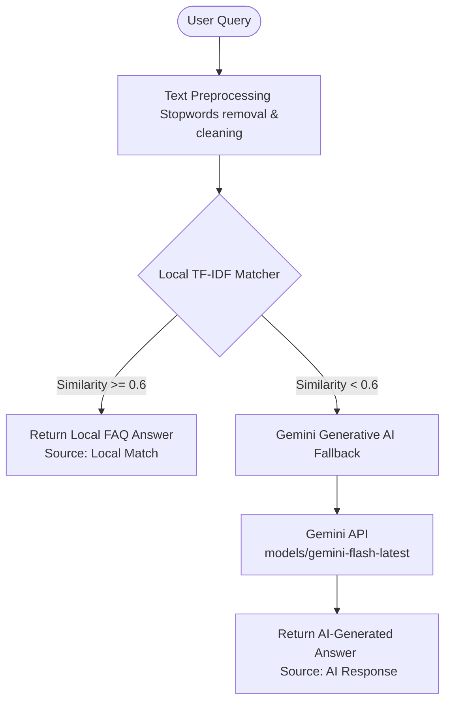

# 🎓 GLA University College Helpdesk Chatbot

Welcome to the **GLA University College Helpdesk Chatbot**! This is a state-of-the-art **hybrid chatbot** designed to assist students, parents, and visitors with academic, fee-related, hostel, and general queries in both **English** and **Hindi**.

---

## 🚀 Quick Start Guide

We have already initialized and launched the application for you! You can access it immediately:

🔗 **Local Web URL**: [http://localhost:8501](http://localhost:8501)

If you need to stop or restart the application manually, follow these steps:

### 1. Prerequisites
Ensure you have **Python 3.10+** installed on your system.

### 2. Activate the Virtual Environment
Navigate to the project root directory and run:

*   **Windows (PowerShell):**
    ```powershell
    .\venv\Scripts\Activate.ps1
    ```
*   **Windows (CMD):**
    ```cmd
    .\venv\Scripts\activate.bat
    ```
*   **macOS / Linux:**
    ```bash
    source venv/bin/activate
    ```

### 3. Install Dependencies
All required libraries are pre-installed in the virtual environment. If you ever need to reinstall them:
```bash
pip install -r requirements.txt
```

### 4. Run the Chatbot
Launch the Streamlit app with the following command:
```bash
streamlit run app.py
```
This will automatically open the web app in your default browser at `http://localhost:8501`.

---

## 🛠️ System Architecture

The chatbot is built using a **hybrid architecture** that balances speed, cost, and reliability:



### 1. Local FAQ Matcher (Fast & Reliable)
*   **Method:** TF-IDF (Term Frequency-Inverse Document Frequency) + Cosine Similarity using `scikit-learn`.
*   **Dataset:** Pre-compiled FAQs in `data/college_faq.csv`.
*   **Confidence Threshold:** Set to `0.6`. If the similarity score is above this threshold, the chatbot instantly returns the verified answer from the local database, ensuring 100% factual accuracy and zero API latency/cost.

### 2. Generative AI Fallback (Flexible & Smart)
*   **Model:** `gemini-flash-latest` (powered by Google's Gemini API).
*   **Behavior:** When the user query does not match any local FAQ, the system smoothly falls back to the Gemini API, responding as a helpful and polite college administrator.
*   **Bilingual Support:** Responds seamlessly in either **English** or **Hindi** depending on your selected language preference in the sidebar.

---

## 📂 Project Structure

```text
├── data/
│   └── college_faq.csv      # The core local FAQ knowledge base (50+ verified Q&As)
├── utils/
│   ├── api_handler.py       # Handles interaction with the Google Gemini API (fallback)
│   └── nlp_engine.py        # Custom NLP matching pipeline (preprocessing, TF-IDF, similarity)
├── venv/                    # Python virtual environment (pre-configured)
├── .env                     # Configuration file containing the Gemini API Key
├── app.py                   # Main Streamlit web application (UI, state, and dashboard)
├── requirements.txt         # List of Python dependencies
└── README.md                # This detailed documentation
```

---

## 📊 Beautiful Features Implemented

*   **Vibrant Glassmorphic UI:** Modern web styling with customized badges, clean card items, and subtle micro-animations for responses.
*   **Bilingual Toggle:** Switch between English and Hindi with a single click in the sidebar.
*   **Quick Action Prompts:** Clickable buttons at the top of the chat to quickly query popular topics like admissions, fees, hostel, scholarship, and exams.
*   **Suggested Follow-ups:** Dynamic, context-aware suggestions for your next questions based on the current discussion.
*   **Escalation Form:** If the chatbot is unable to resolve your query, the app provides a one-click mail generator that drafts a structured email to `helpdesk@gla.ac.in` on your behalf.
*   **Interaction Analytics:** A real-time sidebar dashboard showing your session stats, local vs. AI response ratios, and top-asked topics.

---

## 📝 Example Questions to Tryii

Here are some verified questions you can ask the chatbot right now:

*   **Admissions:** *"What is the admission process for B.Tech?"* or *"What documents are required during admission?"*
*   **Fees & Account:** *"How do I pay my semester fees?"* or *"What should I do if my fee payment fails?"*
*   **Academic / Exams:** *"When will the mid-semester exams begin?"* or *"What happens if I fail an exam?"*
*   **Campus Life & General:** *"I lost my ID card, how do I get a new one?"* or *"Where is the student grievance cell?"*
*   **Hindi Query (Switch Language first):** *"क्या हॉस्टल में वाई-फाई की सुविधा है?"* or *"एडमिशन की अंतिम तिथि क्या है?"*
